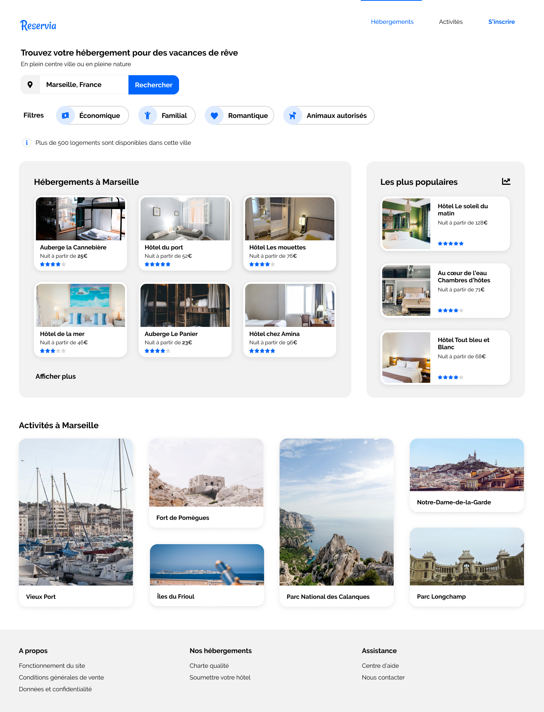

Projet 2 OpenClassrooms "Reservia"

Scénario :
Intégrer une maquette responsive en HTML et CSS.

    Fonctionnalités
Les usagers pourront rechercher des hébergements dans la ville de leur choix. 
Le champ de recherche est donc un champ de saisie, dont le texte peut être édité par l’usager. 
En revanche, à ce stade, le bouton de recherche ne sera pas fonctionnel. 
Chaque carte d’hébergement ou d’activité devra être cliquable dans son intégralité. Pour l’instant les liens seront vides. 
Les filtres ne seront pas fonctionnels pour cette version, en revanche, il faut qu’ils changent d’apparence au survol. 
Dans le menu, les liens “Hébergements” et “Activités” sont des ancres qui doivent mener aux sections de la page. 
 

    Contraintes techniques
Le site devra également être adapté aux tablettes. 
Sur ce support, libre de faire les adaptations nécessaires avec la mise en page, tant qu’aucun élément n’est coupé et que le texte a une taille suffisante. 
Les icônes proviennent de la bibliothèque Font Awesome. 
Les couleurs de la charte sont le bleu #0065FC, et sa version plus claire #DEEBFF ainsi que le gris pour le fond #F2F2F2. 
La police du site est Raleway. 

Ne pas utilisé de framework ou pré-compilateur CSS pour ce projet (comme SASS par exemple) : coder from scratch. 
Utiliser de préférence Flexbox. 
Le code devra utiliser les balises sémantiques et ne doit contenir aucune erreur ni alerte au validateur W3C HTML et CSS. 
Le site devra être compatible avec les dernières versions de Chrome et Firefox. 
Versionner son code avec Git, et ce dès les premières lignes de code (Git ou GitKraken). 
Déployer la page sur GitHub Pages ou GitLab Pages.
